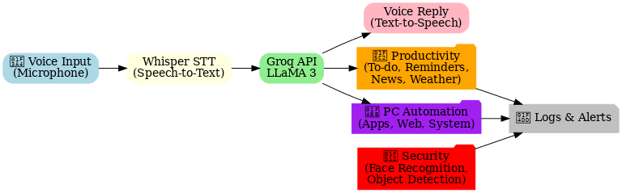

# 🤖 Jarvis AI Assistant  

A modular, voice-enabled AI assistant that integrates **computer vision, natural conversation, productivity tools, and PC automation** into one unified system.  

Designed as a real-time AI-powered personal assistant, Jarvis combines **face/object recognition, voice interaction, and smart automation** to act as your all-in-one desktop AI.  

---

## 🚀 Features  

### 🧠 Core AI  
- 🎙️ Voice commands (speech-to-text)  
- 💬 Natural chat powered by **Groq API (Meta LLaMA 3 model)**  
- 🔊 Voice replies (text-to-speech)  

### 📅 Productivity  
- ✅ To-do list manager  
- ⏰ Reminders & notifications  
- ⏱️ Alarms & timers  
- 📰 News updates (via API)  
- 🌦️ Weather reports (via API)  
- 🌍 World clock & time updates  

### 👁️ Vision (Security)  
- 👤 Face recognition (authorized / unauthorized)  
- 🙂 Facial expression detection  
- 🎯 Object detection (YOLOv8)  
- 🚨 Unauthorized alerts + voice warnings  

### 🖥️ PC Automation  
- 📂 Open/close applications  
- 🖱️ Control apps with voice  
- ⌨️ Voice typing anywhere  
- 🔍 Smart search (Google, YouTube, Amazon, Flipkart)  
- 📝 Auto form filling & navigation  
- 🖲️ Scroll, click, tab switching via voice  
- 💻 Shutdown / restart / sleep via voice  

### ⚡ Extra Smart Features  
- 🗨️ AI Friend conversation mode  
- 🔋 Battery monitoring + alerts  

---

## 🏗️ System Architecture  

<p align="center">
  
</p>  

---

## 📂 Project Structure  

Jarvis-AI-Assistant/
│── main.py # Runs security modules (face + object detection)
│── ai_core/ # Core assistant logic (chat, speech, processing)
│── productivity/ # To-do, reminders, alarms, news, weather
│── pc_automation/ # App + system control modules
│── system/ # Monitoring utilities
│── models/ # Pretrained models (YOLO, face recognition, etc.)
│── data/ # Training/evaluation data
│── docs/ # Documentation + architecture diagram
│── requirements.txt
│── README.md
│── .gitignore

yaml
Copy code

---

## ⚙️ Installation  

```bash
# Clone the repository
git clone https://github.com/Subrahmanyeswar/Jarvis-AI-Assistant.git
cd Jarvis-AI-Assistant

# Create virtual environment (recommended)
python -m venv .venv
.\.venv\Scripts\activate   # (Windows)

# Install dependencies
pip install -r requirements.txt
▶️ Running Jarvis
Jarvis has two modules that need to run in parallel:

1️⃣ Run Security System (Face + Object Detection)

bash
Copy code
python main.py
2️⃣ Run Jarvis Core (AI Assistant, Productivity, Automation)

bash
Copy code
python -m ai_core.main_ai
🔑 API Setup
Groq API (for natural chat)
Get your API key from Groq Console

Add it to an .env file:

ini
Copy code
GROQ_API_KEY=your_key_here
News API (for daily news)
Sign up at NewsAPI

Add to .env:

ini
Copy code
NEWS_API_KEY=your_key_here
Weather API (for weather reports)
Use OpenWeather

Add to .env:

ini
Copy code
WEATHER_API_KEY=your_key_here
📈 Future Roadmap
🌐 Web dashboard for real-time monitoring

📱 Mobile companion app

👥 Multi-user support (face-based personalization)

😃 Advanced emotion recognition

☁️ Cloud sync for tasks & reminders

🤝 Contribution
Pull requests are welcome! For major changes, please open an issue first to discuss what you’d like to change.

📬 Contact
👨‍💻 Developed by Subrahmanyeswar
📧 Email: subrahmanyeswarkolluru@gmail.com
🌐 GitHub: @Subrahmanyeswar
